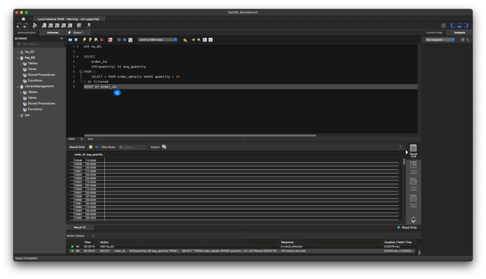
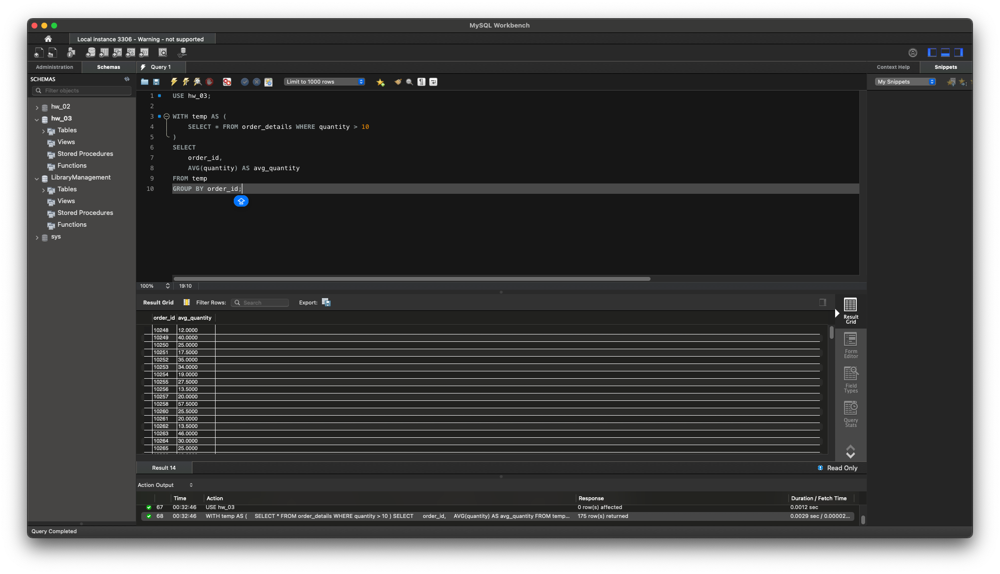

# Домашнє завдання до Теми 5. Вкладені запити. Повторне використання коду

1. Напишіть SQL запит, який буде відображати таблицю order_details та поле customer_id з таблиці orders відповідно для кожного поля запису з таблиці order_details.
Це має бути зроблено за допомогою вкладеного запиту в операторі SELECT.
```SQL 
SELECT 
    order_details.*,
    (SELECT customer_id FROM orders WHERE orders.id = order_details.order_id) AS customer_id
FROM 
    order_details; 
```


2. Напишіть SQL запит, який буде відображати таблицю order_details. Відфільтруйте результати так, щоб відповідний запис із таблиці orders виконував умову shipper_id=3.
Це має бути зроблено за допомогою вкладеного запиту в операторі WHERE.
```SQL 
SELECT *
FROM order_details
WHERE order_id IN (
    SELECT id FROM orders WHERE shipper_id = 3
);
```


3. Напишіть SQL запит, вкладений в операторі FROM, який буде обирати рядки з умовою quantity>10 з таблиці order_details. Для отриманих даних знайдіть середнє значення поля quantity — групувати слід за order_id.
```SQL 
SELECT 
    order_id,
    AVG(quantity) AS avg_quantity
FROM (
    SELECT * FROM order_details WHERE quantity > 10
) AS filtered
GROUP BY order_id;
```



4. Розв’яжіть завдання 3, використовуючи оператор WITH для створення тимчасової таблиці temp. Якщо ваша версія MySQL більш рання, ніж 8.0, створіть цей запит за аналогією до того, як це зроблено в конспекті.
```SQL 
WITH temp AS (
    SELECT * FROM order_details WHERE quantity > 10
)
SELECT 
    order_id,
    AVG(quantity) AS avg_quantity
FROM temp
GROUP BY order_id;
```



5. Створіть функцію з двома параметрами, яка буде ділити перший параметр на другий. Обидва параметри та значення, що повертається, повинні мати тип FLOAT.
Використайте конструкцію DROP FUNCTION IF EXISTS. Застосуйте функцію до атрибута quantity таблиці order_details . Другим параметром може бути довільне число на ваш розсуд.
```SQL 
DROP FUNCTION IF EXISTS division;

DELIMITER $$
CREATE FUNCTION division(a FLOAT, b FLOAT) RETURNS FLOAT
DETERMINISTIC
BEGIN
    RETURN a / b;
END$$
DELIMITER ;

-- Приклад застосування до order_details.quantity (другий параметр, наприклад, 2.2):

SELECT 
    id,
    quantity,
    division(quantity, 2.2) AS divided_quantity
FROM order_details;
```
